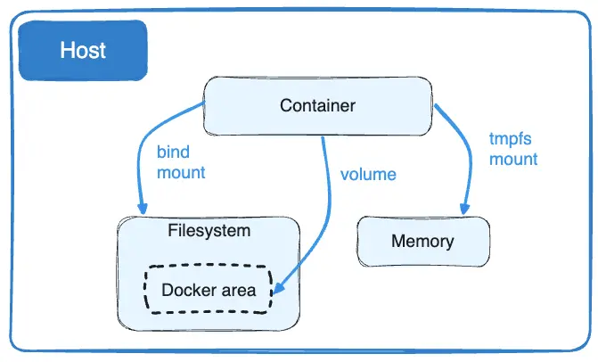

# Docker

## Docker container

- Isolate environment => no knowledge of your operation system or your file
- Runs on the environment provided to you by `Docker Desktop`
- Containers have everything that your code needs in order to run, down to a base operating system
- `docker init`
- `docker build -t welcome-to-docker .` to build image from a Dockerfile
- `docker run -dp 127.0.0.1:3000:3000 getting-started` to start an app Container
- `docker ps` to list containers

## Multi-container app

- Docker Compose could start multiple containers with a single command
- `docker compose up -d` to run multiple containers
- `docker compose watch` to see real time changes

## Persist container data

- `Volume` helps data persistence
- Set it in `compose.yaml` file

## Access a local folder

- `Bind mount`
- Set it in `compose.yaml` file

## Volumes vs bind mounts vs tmpfs mounts

- `Volumes` are stored in a part of the host filesystem which is managed by Docker. Non-Docker processes should not modify this part of the filesystem. Volumes are the best way to persist data in Docker.
- `Bind mounts` may be stored anywhere on the host system. They may even be important system files or directories. Non-Docker processes on the Docker host or a Docker container can modify them at any time.
- `tmpfs` mounts are stored in the host system's memory only, and are never written to the host system's filesystem.

