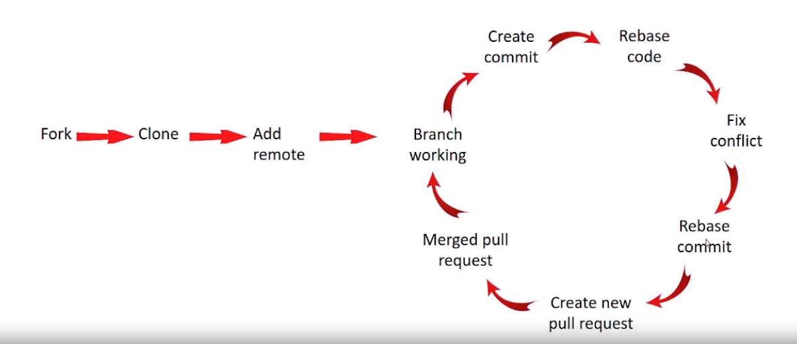

# Git

## Git flow at Sun*

- B1: Fork => clone => add remote (chỉ làm 1 lần)
- B2: Checkout branch và làm => nếu đã xong, checkout về main, pull code mới nhất => checkout về branch và rebase main => fix conflict (nếu có)
- B3: Tạo pull request => check pull teammate nếu làm việc chung => merge và tiếp tục B2

- Lưu ý: compare remote mình và remote sun, check từng rules

## Git push và push -f

- `git push` sẽ đẩy các commit mới lên `remote repository`. Tuy nhiên, nếu có sự xung đột giữa lịch sử commit trên máy `local` và trên `remote repository`, lệnh này sẽ báo lỗi và yêu cầu cập nhật trước khi đẩy
- `git push -f` sẽ bỏ qua mọi xung đột và ép buộc `remote repository` chấp nhận lịch sử commit mới nhất từ máy `local`

## Git merge và git rebase

## Git pull và git fetch
