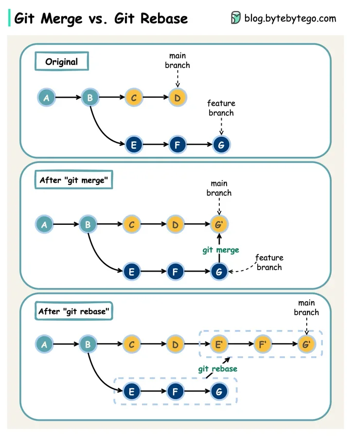

# Git

## Git flow at Sun*

- B1: Fork => clone => add remote (chỉ làm 1 lần)
- B2: Checkout branch và làm => nếu đã xong, checkout về main, pull code mới nhất => checkout về branch và rebase main => fix conflict (nếu có)
- B3: Tạo pull request => check pull teammate nếu làm việc chung => merge và tiếp tục B2

- Lưu ý: compare remote mình và remote sun, check từng rules

## So sánh

### Git push vs push -f

- `git push` sẽ đẩy các commit mới lên `remote repository`. Tuy nhiên, nếu có sự xung đột giữa lịch sử commit trên máy `local` và trên `remote repository`, lệnh này sẽ báo lỗi và yêu cầu cập nhật trước khi đẩy
- `git push -f` sẽ bỏ qua mọi xung đột và ép buộc `remote repository` chấp nhận lịch sử commit mới nhất từ máy `local`

### Git merge vs git rebase

Giả sử có 2 nhánh `master` và `feature`

- Muốn merge code từ `feature` vào `master`:
  - B1: `git checkout master`
  - B2: `git merge feature`
  => `git merge` sẽ căn cứ vào 3 commit để tạo ra 1 commit mới gộp cả 3 lại ở nhánh `master`, nếu có xung đột thì phải xử lý. `git merge` làm những nhánh đang tồn tại không bị thay đổi

- Muốn rebase code từ `feature` vào `master`:
  - B1: `git checkout feature`
  - B2: `git rebase master`
  => `git rebase` sẽ đưa toàn bộ commit ở nhánh `feature` nối tiếp nhánh `master` và viết lại lịch sử commit

### Git pull vs git fetch

## Các case sử dụng git

### 1. Combine commits into one commit

### 2. Ignore committed file

### 3. Change branch name

### 4. Commit to other branch by mistake

### 5. Commit by mistake and remove it

### 6. Combine commits from other branch

### 7. In the middle of work but navigate to other branch

### 8. Remove important commit by mistake

### 9. Undo merge

### 10. Pull branch from remote to local repository

- B1: `git pull` all code về
- B2: `git branch -a` check tất cả branch local và remote
- B3: `git checkout branch-mong-muon`
- B4: `git pull`

**Notes:**
  - You can clone the branch with `git clone -b branch-name github-repo-link`
  - Pull to update the branch: `git pull origin branch-name`
