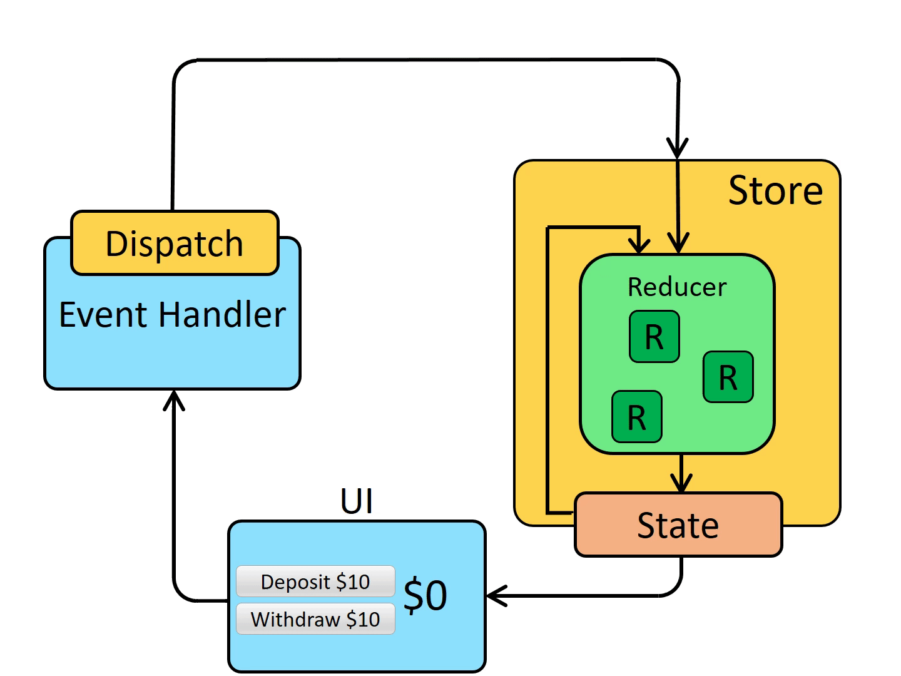

# Reactjs

- Passing function through `props`
- **Immutability** in react -> to undo changes, ...

## Hooks

### useState

...

### useEffect

- Deals with side effects

#### No dependencies

#### Blank dependencies

#### Have dependencies

### useRef

### useCallback

# HOC (High order component)

- A function that have parameters as another component and return new component

# Redux

Main concept:

- `Dispatch`: send the action
- `Action`: has the { type: action-type, payload: data-to-transfer } and goes to store. `Actions` are plain JS objects
- `Store`: Contains `state` and `reducer` to handle state changes. `Reducers` specify how the state should be updated based on those `actions`

# Some useful libraries/frameworks

## Create projects

- create-react-app: https://create-react-app.dev/docs/getting-started
- Vite: https://vitejs.dev/guide/ - Use with `typescript`

## Clean code

- Eslint: https://eslint.org/docs/latest/use/getting-started - find JS errors
- Prettier: https://prettier.io/docs/en/ - formating code

## Styling

- Tailwind: https://tailwindcss.com/docs/installation
- Shadcn: https://ui.shadcn.com/
- MUI: https://mui.com/material-ui/getting-started/
- Ant design: https://ant.design/docs/react/introduce
- Lucide-react (icon): https://lucide.dev/guide/packages/lucide-react

## State management

- Redux/Redux-toolkit: https://redux.js.org/introduction/getting-started
- Redux-saga: https://redux-saga.js.org/docs/introduction/GettingStarted
- Redux-persist: https://github.com/rt2zz/redux-persist
- Redux-logger: https://github.com/LogRocket/redux-logger#readme

## Form validation

- react-hook-form: https://react-hook-form.com/get-started
- zod: https://zod.dev/?id=introduction - Schema declaration and validation library

## API requests & responses

- Axios: https://axios-http.com/docs/intro
- `fetch` (vanilla JS)

## Utils

- clxs: https://github.com/lukeed/clsx#readme - Constructing `className`
- Query-string: https://github.com/sindresorhus/query-string#readme - Handle URL strings
- lodash: https://lodash.com/ - Manipulating arrays, objects, and other types of data

## Commit rules

- Husky: https://typicode.github.io/husky/
- Commitlint: https://github.com/conventional-changelog/commitlint
