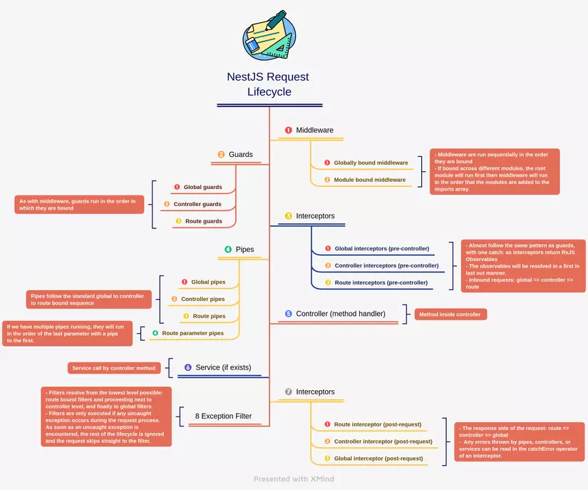

# Nestjs

## Introduction

- A framework for building **Nodejs** server side applications.
- Using Javascript, **TypeScript** and combines elements of OOP, FP, ...
- Using HTTP server frameworks like **ExpressJS** (default) and Fastify (optional)
- Solving the main problem of ExpressJS: **Architecture**
- Hoạt động theo mô hình **module**
- Modules > Controllers > Services

## Nestjs request lifecycle

## Controllers

## Question bank

### 1. What is Nestjs?

- A framework for building **Nodejs** server side applications.
- Using Javascript, **TypeScript** and combines elements of OOP, FP, ...
- Using HTTP server frameworks like **ExpressJS** (default) and Fastify (optional)
- Solving the main problem of ExpressJS: **Architecture**
- Hoạt động theo mô hình **module**
- Modules > Controllers > Services

### 2. Nestjs key features

### 3. Create a new Nestjs application

### 4. Dependency injection (DI) in Nestjs

### 5. Define a provider in Nestjs
